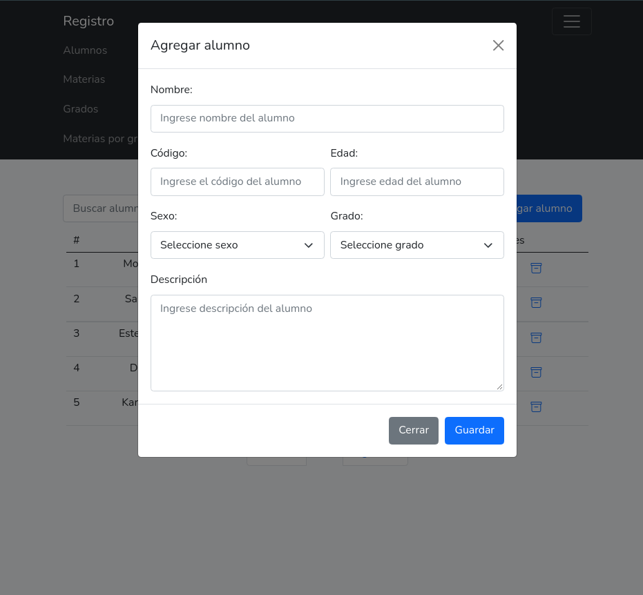
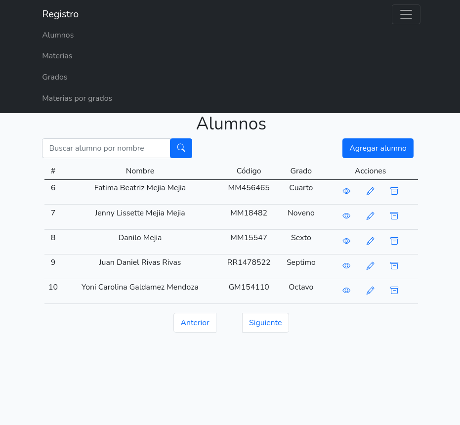

## Acerca de esta aplicación

Mini aplicación creada para evidenciar las tecnologías usadas durante el desarrollo:

- PHP
- JavaScript
- JQuery
- HTML5
- CSS3
- Bootstrap
- Laravel
- MySql
- AlertifyJS

Sin embargo la aplicación, aun no ha sido completada, las tareas realizadas han sido:

- Creación de la base de datos con sus respectivas tablas y relaciones.
- Maquetación de los módulos funcionales.
- CRUD de la tabla mat_materias
- CRUD de la tabla grd_grados